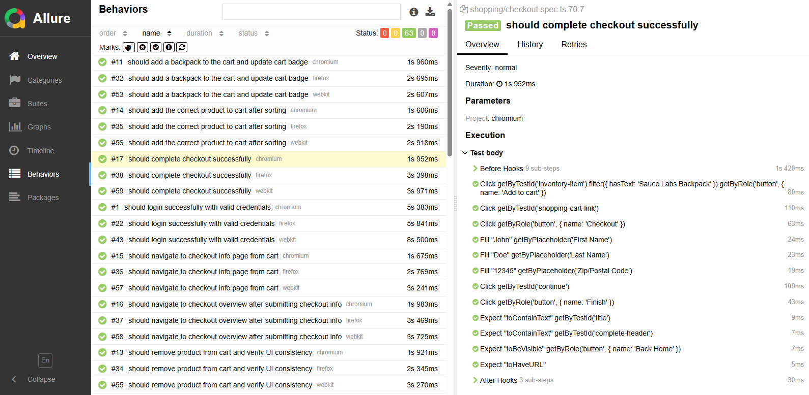

# SauceDemo Playwright QA Automation Portfolio

[](https://github.com/jake5007/saucedemo-playwright-portfolio/actions/workflows/playwright.yml)

This project demonstrates end-to-end test automation using Playwright on the Sauce Demo website.

The goal of this project is to showcase QA automation skills including:

- Test design (positive & negative scenarios)
- Page Object Model (POM)
- End-to-end user flow testing
- Maintainable and scalable test structure
- Data-driven validation using dynamic expected values
- Interaction testing across multiple features

## Tech Stack

- Playwright (TypeScript)
- Node.js

---

## Test Report (Allure)

Test execution results are visualized using Allure Report, providing clear insights into:

- Step-by-step test execution
- Cross-browser testing results
- Execution time and test status
- Detailed failure analysis



---

## Test Coverage

### Authentication

- Login with valid credentials
- Login with locked out user
- Validation: missing username
- Validation: missing password
- Validation: both fields missing
- Invalid password scenario

---

### Cart

- Add product to cart and verify cart badge update
- Remove product from cart and verify UI consistency
  - Cart badge updates correctly
  - Product state resets ("Remove" → "Add to cart")
  - Cart page reflects removal
- Verify product appears in cart after adding

---

### Checkout Flow

#### Happy Path

- Navigate to checkout info page
- Submit user information
- Navigate to checkout overview
- Complete checkout successfully

#### Validation

- Missing first name
- Missing last name
- Missing postal code
- All fields missing
- Verify error message and stay on same page

---

### Sorting

- Validate product sorting by name (A → Z, Z → A)
- Validate product sorting by price (low → high, high → low)
- Verify correct ordering by comparing UI data with dynamically generated expected values
- Ensure accurate sorting through string and numeric comparison strategies

---

### Feature Interaction

- Verify correct product can be added to cart after sorting
- Ensure cart functionality works correctly even when product order changes

## Project Structure

- tests/auth/login.spec.ts → authentication test scenarios
- tests/shopping/cart.spec.ts → cart-related test scenarios
- tests/shopping/checkout.spec.ts → checkout flow and validation tests
- tests/inventory/sort.spec.ts → sorting test scenarios

- tests/helpers/sortHelpers.ts → reusable sorting logic for expected value generation

- pages/LoginPage.ts → Page Object for login page
- pages/InventoryPage.ts → Page Object for inventory page
- pages/CartPage.ts → Page Object for cart page
- pages/CheckoutInfoPage.ts → Page Object for checkout step one
- pages/CheckoutOverviewPage.ts → Page Object for checkout overview
- pages/CheckoutCompletePage.ts → Page Object for checkout complete page

## How to Run

```bash
npm install
npx playwright test
```

---

## Future Improvements

- Introduce structured test data management using fixtures
- Expand feature interaction scenarios (e.g., sorting + checkout flow)
